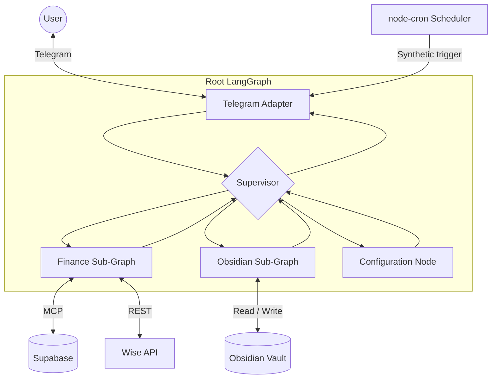

# Personal Assistant

A Telegram-based personal assistant built with [LangGraph](https://langchain-ai.github.io/langgraph/). A root **Supervisor** routes each message to specialized sub-agents for finance, Obsidian notes, or system configuration. The bot runs locally (or in Docker), polls Telegram for updates, and keeps conversation state in a bounded message window.

## Architecture



| Component | Role |
|---|---|
| **Supervisor** | Intent routing via structured JSON output (`FINISH`, `Finance_SG`, `Obsidian_SG`, `Config_SG`) |
| **Finance sub-graph** | Expense tracking, Wise transaction sync, SQL via Supabase MCP |
| **Obsidian sub-graph** | Markdown vault read/write with multi-step tool loops (up to 8 steps per request) |
| **Configuration node** | Cron job management and skill CRUD (create, edit, delete, preview) |
| **Skills** | Reusable step-by-step playbooks in `skills/{owner}/` injected into agent prompts |
| **Scheduler** | Optional `node-cron` daemon that injects `SYSTEM_CRON_TRIGGER:` messages into the graph |

The assistant keeps only the last **10 messages** per thread. Older turns are trimmed once the window is exceeded, while preserving in-flight tool-call sequences as atomic units.

## Prerequisites

- Node.js **20+**
- [pnpm](https://pnpm.io/) (see `packageManager` in `package.json`)
- A Telegram bot token and your Telegram user ID

## Local Development

```sh
pnpm install
cp .env.example .env   # fill in required values
pnpm dev
```

### Required environment variables

| Variable | Description |
|---|---|
| `TELEGRAM_BOT_TOKEN` | Bot token from [@BotFather](https://t.me/BotFather) |
| `ALLOWED_TELEGRAM_USER_ID` | Only this Telegram user can interact with the bot |
| `GOOGLE_API_KEY` | Google AI API key for Gemini models |

### Optional environment variables

| Variable | Default | Description |
|---|---|---|
| `GEMINI_MODEL` | `gemini-2.5-flash-lite` | Fallback model for all agents |
| `SUPERVISOR_MODEL` | `GEMINI_MODEL` | Model for the root supervisor |
| `OBSIDIAN_MODEL` | `GEMINI_MODEL` | Model for the Obsidian sub-graph |
| `FINANCE_MODEL` | `GEMINI_MODEL` | Model for the Finance sub-graph |
| `APP_TIMEZONE` | `UTC` | IANA timezone for date hints and cron scheduling |
| `OBSIDIAN_VAULT_PATH` | `src/obsidian-vault` | Local path to the markdown vault |
| `ENABLE_SCHEDULER` | unset (disabled) | Set to `1` or `true` to activate in-process cron |
| `CRON_JOBS_FILE_PATH` | `data/cron-jobs.json` | Persisted cron job definitions |

### Finance sync (optional)

Finance features require Supabase MCP credentials and Wise API access:

| Variable | Description |
|---|---|
| `SUPABASE_PROJECT_REF` | Supabase project reference |
| `SUPABASE_ACCESS_TOKEN` | Supabase personal access token |
| `SUPABASE_MCP_URL` | Hosted MCP endpoint (default: `https://mcp.supabase.com/mcp`) |
| `WISE_API_TOKEN` | Wise API bearer token |
| `WISE_PROFILE_ID` | Wise profile ID for activity fetches |

Database setup:

1. Install the `exec_sql` RPC — see [docs/SUPABASE_SETUP.md](docs/SUPABASE_SETUP.md) and [sql/INSTRUCTIONS.md](sql/INSTRUCTIONS.md)
2. Ensure the `expense` table and dedup constraint exist (see `sql/add_expense_unique_constraint.sql`)

Without Supabase credentials the Finance sub-graph returns a configuration error instead of crashing the app.

### Scheduler (optional)

When `ENABLE_SCHEDULER` is truthy, cron jobs from `data/cron-jobs.json` are loaded at startup and executed via synthetic `SYSTEM_CRON_TRIGGER:` messages. Jobs can target `Finance_SG`, `Obsidian_SG`, or `Config_SG`. Create and manage jobs through the configuration agent in Telegram (e.g. "list cron jobs", "schedule a daily finance sync").

## Skills

Skills are markdown playbooks with YAML frontmatter, organized by owner:

```
skills/
  finance/
    sync-expenses.md
  obsidian/
  configurator/
```

Each skill file requires `name` and `description` in frontmatter. Agent prompts automatically list available skills for their domain and expose `read_skill` (execution agents) or full CRUD tools (configurator). The finance `sync-expenses` skill drives the Wise → categorize → dedup-insert pipeline.

## System prompts

Prompt sources of truth live under `prompts/`:

| Agent | File |
|---|---|
| Supervisor | `prompts/supervisor.xml` |
| Obsidian | `prompts/obsidian.xml` |
| Finance | `prompts/finance.xml` |
| Configurator | `prompts/configurator.md` |

Prompts are read from disk on each invocation, so edits take effect without restarting the process during local development.

## Docker Compose

The Compose setup supports production-style and development containers.

### Production-style container

Create a `.env` file, then run:

```sh
docker compose up --build
```

| Mount | Host default | Container path |
|---|---|---|
| Obsidian vault | `./src/obsidian-vault` | `/data/obsidian-vault` |

Override the vault host path with `OBSIDIAN_VAULT_HOST_PATH` in your shell or `.env`. Inside the container, `OBSIDIAN_VAULT_PATH` is set to `/data/obsidian-vault`.

The production image copies `prompts/` but not `skills/` or vault data. To use custom skill playbooks in the production container, mount `./skills:/app/skills` (the app reads from `skills/` relative to its working directory).

### Development container

Bind-mounted source with `pnpm dev` inside the container:

```sh
docker compose --profile dev up --build personal-assistant-dev
```

The dev service mounts the workspace into `/app`, keeps `node_modules` in a named Docker volume, and mounts the vault separately so note files persist outside the container.

## Testing

```sh
pnpm test:unit          # Vitest unit tests
pnpm test:e2e           # Playwright end-to-end tests
pnpm test               # Both suites
pnpm check              # TypeScript type check
```

## Project layout

```
src/
  agent.ts              # Root LangGraph wiring
  app.ts                # App bootstrap (Telegram, cron, subgraphs)
  nodes/
    supervisor-node.ts  # Intent router
    finance/            # Finance sub-graph
    obsidian/           # Obsidian sub-graph
    configurator/       # Cron + skill management
  prompts/              # Prompt and skill loading
  cron/                 # Scheduler bootstrap and runner
  tools/                # Shared tools (skills, routing)
  telegram/             # Telegram adapter and file sender
prompts/                # System prompt files (.xml / .md)
skills/                 # Agent skill playbooks
specs/                  # Design documents
tests/                  # Unit and e2e tests
```
