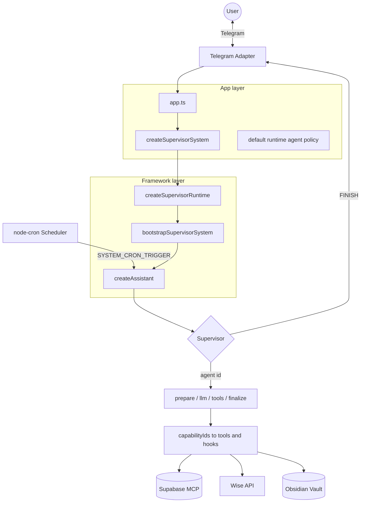

# Personal Assistant

A Telegram-based personal assistant built with [LangGraph](https://langchain-ai.github.io/langgraph/). A root **Supervisor** routes each message to specialized sub-agents for finance, Obsidian notes, or system configuration. The bot runs locally (or in Docker), polls Telegram for updates, and keeps conversation state in a bounded message window.

## Architecture

The codebase is a **pnpm workspace**. Reusable supervisor bootstrap lives in `packages/supervisor-framework/`; this Telegram assistant lives in `apps/personal-assistant/`. Entry point: `createSupervisorSystem()` → `createSupervisorRuntime()` → `bootstrapSupervisorSystem()` → `createAssistant()`.



See [docs/ARCHITECTURE.md](docs/ARCHITECTURE.md) for request lifecycle, state, and persistence boundaries.

Routing uses **agent ids** (`finance`, `obsidian`, `configuration`, or custom ids from the runtime-agent repository). Creating a new agent via the configuration agent is picked up when the bot and scheduler recompile from `data/runtime-agents.json` (usually within a few seconds).

Message history is trimmed to a configurable token budget (default ~6,000 estimated tokens via `MESSAGE_HISTORY_MAX_TOKENS`).

## Prerequisites

- Node.js **20+**
- [pnpm](https://pnpm.io/) (see `packageManager` in `package.json`)
- A Telegram bot token and your Telegram user ID

## Local Development

```sh
pnpm install
cp .env.example .env   # fill in required values
pnpm dev
```

### Required environment variables

| Variable | Description |
|---|---|
| `TELEGRAM_BOT_TOKEN` | Bot token from [@BotFather](https://t.me/BotFather) |
| `ALLOWED_TELEGRAM_USER_ID` | Only this Telegram user can interact with the bot |
| `ALLOWED_TELEGRAM_CHAT_ID` | Optional; chat id that may receive bot traffic (defaults to user id for private chats) |
| `STATE_DB_PATH` | Optional; SQLite file for conversation checkpoints and cron run ledger (default `data/state.db`) |
| `PERSISTENCE_ENABLED` | When false, use in-memory checkpoints and skip the cron ledger (default true) |
| `GOOGLE_API_KEY` | Google AI API key for Gemini models |

### Optional environment variables

| Variable | Default | Description |
|---|---|---|
| `GEMINI_MODEL` | `gemini-2.5-flash-lite` | Fallback model for all agents |
| `SUPERVISOR_MODEL` | `GEMINI_MODEL` | Model for the root supervisor |
| `OBSIDIAN_MODEL` | `GEMINI_MODEL` | Model for agents with `modelKey: obsidian` |
| `FINANCE_MODEL` | `GEMINI_MODEL` | Model for agents with `modelKey: finance` |
| `CONFIGURATION_MODEL` | `OBSIDIAN_MODEL` then `GEMINI_MODEL` | Model for agents with `modelKey: configuration` |
| `APP_TIMEZONE` | `UTC` | IANA timezone for date hints and cron scheduling |
| `OBSIDIAN_VAULT_PATH` | `src/obsidian-vault` | Local path to the markdown vault |
| `ENABLE_SCHEDULER` | unset (disabled) | Enables the dedicated scheduler process (`pnpm dev:scheduler` / `personal-assistant-scheduler`). When disabled, that process stays idle until shutdown instead of scheduling jobs. The Telegram bot never runs in-process cron. |
| `CRON_JOBS_FILE_PATH` | `data/cron-jobs.json` | Persisted cron job definitions |
| `ENABLE_PROMPT_LOGS` | `true` | Log assembled system prompts to the console (`false` in test scripts) |

### LangSmith tracing (optional)

LangGraph automatically sends traces to [LangSmith](https://smith.langchain.com) when these variables are set — no graph or code changes required. You get a visual debugger for the supervisor, flat runtime-agent nodes (prepare / llm / tools / finalize), and every LLM prompt.

| Variable | Default | Description |
|---|---|---|
| `LANGCHAIN_TRACING_V2` | unset (disabled) | Set to `true` to enable tracing |
| `LANGCHAIN_API_KEY` | — | API key from LangSmith → Settings → API Keys |
| `LANGCHAIN_PROJECT` | `default` | Project name in the LangSmith UI (e.g. `personal-assistant`) |

### Finance sync (optional)

Finance features require Supabase MCP credentials and Wise API access:

| Variable | Description |
|---|---|
| `SUPABASE_PROJECT_REF` | Supabase project reference |
| `SUPABASE_ACCESS_TOKEN` | Supabase personal access token |
| `SUPABASE_MCP_URL` | Hosted MCP endpoint (default: `https://mcp.supabase.com/mcp`) |
| `MCP_MAX_RECONNECT_ATTEMPTS` | Reconnect retries after transport failure (default: `1`) |
| `MCP_RECONNECT_BASE_DELAY_MS` | Initial backoff before first reconnect (default: `0` — immediate retry) |
| `MCP_RECONNECT_MAX_DELAY_MS` | Cap on exponential backoff delay (default: `5000`) |
| `WISE_API_TOKEN` | Wise API bearer token |
| `WISE_PROFILE_ID` | Wise profile ID for activity fetches |

Database setup:

1. Install the `exec_sql` RPC — see [docs/SUPABASE_SETUP.md](docs/SUPABASE_SETUP.md) and [sql/INSTRUCTIONS.md](sql/INSTRUCTIONS.md)
2. Ensure the `expense` table and dedup constraint exist (see `sql/add_expense_unique_constraint.sql`)

Without Supabase credentials the finance agent returns a configuration error instead of crashing the app.

### Scheduler (optional)

Production Docker runs scheduling in the separate `personal-assistant-scheduler` service. When `ENABLE_SCHEDULER` is truthy, that process loads jobs from `data/cron-jobs.json` and executes them via synthetic `SYSTEM_CRON_TRIGGER:` messages. When disabled, the scheduler process stays idle (no jobs run) until it receives SIGINT/SIGTERM. Jobs target runtime agent ids such as `finance`, `obsidian`, or `configuration` using the format `SYSTEM_CRON_TRIGGER:<agentId>:<jobName>`. Create and manage jobs through the configuration agent in Telegram (e.g. "list cron jobs", "schedule a daily finance sync").

## Skills

Skills are XML playbooks stored in a flat `data/skills/` directory. Each file requires `name`, `module`, and `description` on the root `<skill>` element:

```
data/skills/
  cron.xml
  daily-routine-note-creation.xml
  expense-ledger-schema.xml
  expense-sync.xml
  expense-update.xml
  expense-view.xml
  finance-summary.xml
  runtime-agents.xml
  skill-bootstrap.xml
  skill-management.xml
```

The `module` attribute (`finance`, `obsidian`, or `configuration`) controls which runtime agent lists and auto-attaches the skill. Optional `<skill_attachments>` blocks define phrase/cron triggers for auto-attachment. The finance `expense-sync` skill drives the Wise → categorize → dedup-insert pipeline.

On startup, if `cron.xml`, `runtime-agents.xml`, `skill-management.xml`, or `skill-bootstrap.xml` are missing from `data/skills/`, the pack's `initializeDefaults` hook seeds them via the framework's `createDefaultContentSeeder()`. Existing files are never overwritten. Domain-specific skills (`expense-*`, `finance-summary`, `daily-routine-note-creation`) are not auto-seeded and must be present in the repo or host volume.

## System prompts

All runtime prompts live under `data/prompts/` (tracked in git; writable via the Compose `./data` volume):

| Agent | File |
|---|---|
| Supervisor | `data/prompts/supervisor.xml` |
| Obsidian | `data/prompts/obsidian.xml` |
| Finance | `data/prompts/finance.xml` |
| Configuration | `data/prompts/configuration.xml` |

Prompts are read from disk on each invocation, so edits take effect without restarting the process during local development.

On startup, if `supervisor.xml` or `configuration.xml` are missing from `data/prompts/`, the pack's `initializeDefaults` hook seeds them via the framework's `createDefaultContentSeeder()`. Existing files are never overwritten. Domain-specific prompts (`finance.xml`, `obsidian.xml`) are not auto-seeded.

## Docker Compose

The Compose setup supports production-style and development containers.

### Production-style container

Create a `.env` file, then run:

```sh
docker compose up --build
```

| Mount | Host default | Container path |
|---|---|---|
| Obsidian vault | `./src/obsidian-vault` | `/data/obsidian-vault` |
| Persisted JSON (`runtime-agents`, cron jobs), prompts, skills | `./data` | `/app/apps/personal-assistant/data` |
| Process logs (when file logging enabled) | `./logs` | `/app/apps/personal-assistant/logs` |

Override host paths with `OBSIDIAN_VAULT_HOST_PATH` and `DATA_HOST_PATH` in your shell or `.env`. Inside the container, `OBSIDIAN_VAULT_PATH` is set to `/data/obsidian-vault`.

Both `personal-assistant` and `personal-assistant-scheduler` mount the same `data/` volume so runtime-agent and cron definitions changed through Telegram are visible to both processes. The shared volume also holds `state.db` (conversation checkpoints and cron run ledger) when persistence is enabled. **Single-writer discipline:** the bot process owns all `./data` JSON mutations; the scheduler reads definitions and watches for changes but cannot persist runtime-agent or cron JSON (read-only repository wrappers). The scheduler may write cron execution metadata to `state.db` only.

Each production service exposes HTTP health endpoints on `HEALTH_PORT` (default `8080`): `/health/live` (process up) and `/health/ready` (bootstrap complete). Compose `healthcheck` blocks use readiness so `restart: unless-stopped` can recover wedged processes. Mount `./logs` (override with `LOGS_HOST_PATH`) for append-only process logs when `LOG_TO_FILE` is enabled (default on in production). Only one scheduler instance may run at a time; a lock file at `data/.scheduler-lock` refuses a duplicate scheduler container.

The production image copies `data/prompts/` and `data/skills/` into the container. Prompts, skills, and runtime state persist on the mounted `./data` volume. Configuration skills and supervisor/configuration prompts are auto-seeded from framework defaults when missing at boot; domain-specific skills and prompts still require the repo or host volume on first deploy.

### Development container

Bind-mounted source with `pnpm dev` inside the container:

```sh
docker compose --profile dev up --build personal-assistant-dev
```

The dev service mounts the workspace into `/app`, keeps `node_modules` in a named Docker volume, and mounts the vault separately so note files persist outside the container.

## Testing

```sh
pnpm test:unit          # Vitest unit tests
pnpm test:e2e           # Playwright end-to-end tests
pnpm test               # Both suites
pnpm check              # TypeScript type check
```

## Project layout

```
packages/
  supervisor-framework/     # @personal-assistant/supervisor-framework — reusable pack SDK
    src/core/                 # LangGraph kernel (internal; import via package barrel)
    src/framework/              # bootstrapSupervisorSystem(), resolveAgentTools()
    src/capabilities/         # Capability catalog types
    src/index.ts              # Public exports

apps/
  personal-assistant/         # This Telegram deployment
    src/
      composition/            # createSupervisorSystem, personal-pack, runtime-execution
      policies/               # Domain capability hooks
      runtime-agents/         # Domain folders (finance/, obsidian/), capabilities, resolve-tools
      ports/ integrations/    # External I/O clients (Obsidian, Wise, Supabase MCP)
      scheduler/ telegram/ models/ ...
    data/prompts/ data/skills/ data/ sql/
    tests/unit/               # Layer-aligned unit tests; e2e in tests/e2e/
    Dockerfile docker-compose.yml

docs/                         # Architecture and pack development guides
examples/                     # Client-pack bootstrap walkthrough
```

Run commands from the **repo root** (`pnpm dev`, `pnpm test`, `pnpm check`). Docker Compose lives under `apps/personal-assistant/` with build context at the repo root.

See [docs/PACK_DEVELOPMENT.md](docs/PACK_DEVELOPMENT.md) for building a sibling pack on `@personal-assistant/supervisor-framework`.

### Extending the assistant

- **New specialist (default):** create via the configuration agent with a prompt, optional skills, and grantable `capabilityIds`. Routing picks up automatically after soft graph recompile (~seconds). Step-by-step: [docs/RUNTIME_AGENT_SETUP.md](docs/RUNTIME_AGENT_SETUP.md).
- **New tool domain (rare):** add a capability descriptor + provider in `capabilities.ts`, implement tools under `runtime-agents/<domain>/`, and register capability behavior in `src/policies/runtime-agent-policy.ts` when that capability is granted.
