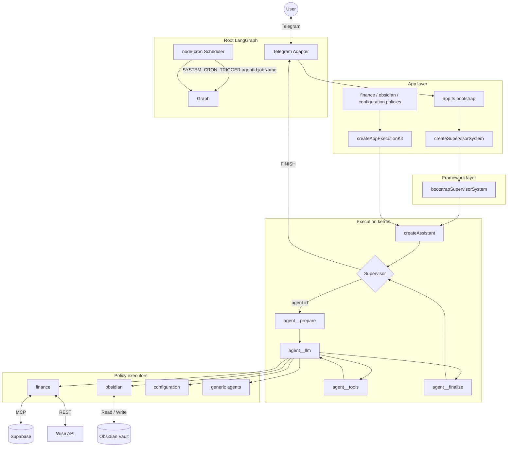

# Personal Assistant

A Telegram-based personal assistant built with [LangGraph](https://langchain-ai.github.io/langgraph/). A root **Supervisor** routes each message to specialized sub-agents for finance, Obsidian notes, or system configuration. The bot runs locally (or in Docker), polls Telegram for updates, and keeps conversation state in a bounded message window.

## Architecture

The codebase is a **pnpm workspace**. Reusable supervisor bootstrap lives in `packages/supervisor-framework/`; this Telegram assistant lives in `apps/personal-assistant/`. The graph entry point is `createAssistant()`; deployments compile it via `bootstrapSupervisorSystem()` (personal pack: `createSupervisorSystem()` in the app).



### Layer responsibilities

| Layer | Path | Responsibility |
|---|---|---|
| **Framework package** | `packages/supervisor-framework/` | Execution kernel + pack SDK (`bootstrapSupervisorSystem`, `createAssistant`, capabilities) |
| **App layer** | `apps/personal-assistant/src/app/` | Built-in policies, per-domain LLM hooks, prompt wiring, `createAppExecutionKit()` |
| **Domain runtime** | `apps/personal-assistant/src/runtime-agents/` | Tool bundles, domain tools (finance / obsidian / configuration), skill attachments |
| **Infrastructure** | `apps/personal-assistant/src/cron/`, `telegram/`, `tools/`, `services/` | Scheduler, Telegram I/O, shared tool plumbing, external integrations |

Each `createAssistant()` call builds an isolated **execution context** with its own `PolicyRegistry` and `loadPromptByKey`, so multiple assistant instances do not share global policy or prompt state.

### Runtime flow

1. **Supervisor** reads the latest user message (or cron trigger) and routes to `FINISH` or a runtime agent id.
2. **Prepare** scopes recent parent messages into `agentMessages`; **llm ⇄ tools** runs the specialist loop; **finalize** merges the final reply back into parent `messages`.
3. Capability-specific behavior is composed in `apps/personal-assistant/src/app/policies/` when an agent grants a capability that needs LLM hooks (e.g. `obsidian-vault`).
4. Control returns to the supervisor until it chooses `FINISH`.

Routing uses **agent ids** (`finance`, `obsidian`, `configuration`, or custom ids from the runtime-agent repository). Only agents wired at graph compile time are routable; creating a new agent via the configuration agent is picked up automatically when the bot and scheduler recompile their graphs from `data/runtime-agents.json` (usually within a few seconds).

| Component | Role |
|---|---|
| **Supervisor** | Intent routing via structured JSON output (`FINISH` or a wired runtime agent id) |
| **Runtime agent loop** | Flat prepare / llm ⇄ tools / finalize nodes per enabled agent |
| **Finance agent** | `generic` + `finance-domain` — expense tracking, Wise sync, SQL via Supabase MCP |
| **Obsidian agent** | `generic` + `obsidian-vault` — markdown vault read/write with multi-step tool loops |
| **Configuration agent** | Virtual system admin — cron jobs, runtime-agent CRUD, skill CRUD |
| **Custom agents** | `generic` + grantable capabilities (prompt, skills, tools from catalog) |
| **Skills** | Reusable step-by-step playbooks in flat `skills/` with a `module` attribute, injected into agent prompts |
| **Scheduler** | Optional `node-cron` daemon that injects `SYSTEM_CRON_TRIGGER:<agentId>:<jobName>` messages into the graph |

Message history is trimmed to a configurable token budget (default ~6,000 estimated tokens via `MESSAGE_HISTORY_MAX_TOKENS`), while preserving in-flight tool-call sequences as atomic units.

## Prerequisites

- Node.js **20+**
- [pnpm](https://pnpm.io/) (see `packageManager` in `package.json`)
- A Telegram bot token and your Telegram user ID

## Local Development

```sh
pnpm install
cp .env.example .env   # fill in required values
pnpm dev
```

### Required environment variables

| Variable | Description |
|---|---|
| `TELEGRAM_BOT_TOKEN` | Bot token from [@BotFather](https://t.me/BotFather) |
| `ALLOWED_TELEGRAM_USER_ID` | Only this Telegram user can interact with the bot |
| `GOOGLE_API_KEY` | Google AI API key for Gemini models |

### Optional environment variables

| Variable | Default | Description |
|---|---|---|
| `GEMINI_MODEL` | `gemini-2.5-flash-lite` | Fallback model for all agents |
| `SUPERVISOR_MODEL` | `GEMINI_MODEL` | Model for the root supervisor |
| `OBSIDIAN_MODEL` | `GEMINI_MODEL` | Model for the Obsidian sub-graph |
| `FINANCE_MODEL` | `GEMINI_MODEL` | Model for the Finance sub-graph |
| `APP_TIMEZONE` | `UTC` | IANA timezone for date hints and cron scheduling |
| `OBSIDIAN_VAULT_PATH` | `src/obsidian-vault` | Local path to the markdown vault |
| `ENABLE_SCHEDULER` | unset (disabled) | Enables the dedicated scheduler process (`pnpm dev:scheduler` / `personal-assistant-scheduler`). When disabled, that process stays idle until shutdown instead of scheduling jobs. The Telegram bot never runs in-process cron. |
| `CRON_JOBS_FILE_PATH` | `data/cron-jobs.json` | Persisted cron job definitions |
| `ENABLE_PROMPT_LOGS` | `true` | Log assembled system prompts to the console (`false` in test scripts) |

### LangSmith tracing (optional)

LangGraph automatically sends traces to [LangSmith](https://smith.langchain.com) when these variables are set — no graph or code changes required. You get a visual debugger for the supervisor, flat runtime-agent nodes (prepare / llm / tools / finalize), and every LLM prompt.

| Variable | Default | Description |
|---|---|---|
| `LANGCHAIN_TRACING_V2` | unset (disabled) | Set to `true` to enable tracing |
| `LANGCHAIN_API_KEY` | — | API key from LangSmith → Settings → API Keys |
| `LANGCHAIN_PROJECT` | `default` | Project name in the LangSmith UI (e.g. `personal-assistant`) |

### Finance sync (optional)

Finance features require Supabase MCP credentials and Wise API access:

| Variable | Description |
|---|---|
| `SUPABASE_PROJECT_REF` | Supabase project reference |
| `SUPABASE_ACCESS_TOKEN` | Supabase personal access token |
| `SUPABASE_MCP_URL` | Hosted MCP endpoint (default: `https://mcp.supabase.com/mcp`) |
| `MCP_MAX_RECONNECT_ATTEMPTS` | Reconnect retries after transport failure (default: `1`) |
| `MCP_RECONNECT_BASE_DELAY_MS` | Initial backoff before first reconnect (default: `0` — immediate retry) |
| `MCP_RECONNECT_MAX_DELAY_MS` | Cap on exponential backoff delay (default: `5000`) |
| `WISE_API_TOKEN` | Wise API bearer token |
| `WISE_PROFILE_ID` | Wise profile ID for activity fetches |

Database setup:

1. Install the `exec_sql` RPC — see [docs/SUPABASE_SETUP.md](docs/SUPABASE_SETUP.md) and [sql/INSTRUCTIONS.md](sql/INSTRUCTIONS.md)
2. Ensure the `expense` table and dedup constraint exist (see `sql/add_expense_unique_constraint.sql`)

Without Supabase credentials the finance agent returns a configuration error instead of crashing the app.

### Scheduler (optional)

Production Docker runs scheduling in the separate `personal-assistant-scheduler` service. When `ENABLE_SCHEDULER` is truthy, that process loads jobs from `data/cron-jobs.json` and executes them via synthetic `SYSTEM_CRON_TRIGGER:` messages. When disabled, the scheduler process stays idle (no jobs run) until it receives SIGINT/SIGTERM. Jobs target runtime agent ids such as `finance`, `obsidian`, or `configuration` using the format `SYSTEM_CRON_TRIGGER:<agentId>:<jobName>`. Create and manage jobs through the configuration agent in Telegram (e.g. "list cron jobs", "schedule a daily finance sync").

## Skills

Skills are XML playbooks stored in a flat `skills/` directory. Each file requires `name`, `module`, and `description` on the root `<skill>` element:

```
skills/
  sync-expenses.xml
  daily-routine-note-creation.xml
  cron.xml
  runtime-agents.xml
  skill-management.xml
```

The `module` attribute (`finance`, `obsidian`, or `configuration`) controls which runtime agent lists and auto-attaches the skill. Optional `<skill_attachments>` blocks define phrase/cron triggers for auto-attachment. Agent prompts list available skills for their module and expose `read_skill` (execution agents) or full CRUD tools (configuration). The finance `sync-expenses` skill drives the Wise → categorize → dedup-insert pipeline.

## System prompts

Prompt sources of truth live under `agents/`:

| Agent | File |
|---|---|
| Supervisor | `agents/supervisor.xml` |
| Obsidian | `agents/obsidian.xml` |
| Finance | `agents/finance.xml` |
| Configuration | `agents/configuration.xml` |

Prompts are read from disk on each invocation, so edits take effect without restarting the process during local development.

## Docker Compose

The Compose setup supports production-style and development containers.

### Production-style container

Create a `.env` file, then run:

```sh
docker compose up --build
```

| Mount | Host default | Container path |
|---|---|---|
| Obsidian vault | `./src/obsidian-vault` | `/data/obsidian-vault` |
| Persisted JSON (`runtime-agents`, cron jobs) | `./data` | `/app/data` |

Override host paths with `OBSIDIAN_VAULT_HOST_PATH` and `DATA_HOST_PATH` in your shell or `.env`. Inside the container, `OBSIDIAN_VAULT_PATH` is set to `/data/obsidian-vault`.

Both `personal-assistant` and `personal-assistant-scheduler` mount the same `data/` volume so runtime-agent and cron definitions changed through Telegram are visible to both processes. JSON writes are serialized within each process; concurrent writes from bot and scheduler can still race across processes.

The production image copies `prompts/` and `skills/` into the container. To override skill playbooks from the host, add a bind mount in a Compose override file, for example `./skills:/app/skills`.

### Development container

Bind-mounted source with `pnpm dev` inside the container:

```sh
docker compose --profile dev up --build personal-assistant-dev
```

The dev service mounts the workspace into `/app`, keeps `node_modules` in a named Docker volume, and mounts the vault separately so note files persist outside the container.

## Testing

```sh
pnpm test:unit          # Vitest unit tests
pnpm test:e2e           # Playwright end-to-end tests
pnpm test               # Both suites
pnpm check              # TypeScript type check
```

## Project layout

```
packages/
  supervisor-framework/     # @personal-assistant/supervisor-framework — reusable pack SDK
    src/core/                 # LangGraph kernel (internal; import via package barrel)
    src/framework/              # bootstrapSupervisorSystem(), resolveAgentTools()
    src/capabilities/         # Capability catalog types
    src/index.ts              # Public exports

apps/
  personal-assistant/         # This Telegram deployment
    src/
      app/                    # Policies, composition, createSupervisorSystem()
      runtime-agents/         # Domain tools and builtin capability providers
      cron/ telegram/ tools/ services/ connectors/ ...
    prompts/ skills/ data/ sql/
    tests/                    # App + integration unit tests, e2e
    Dockerfile docker-compose.yml

docs/                         # Architecture and pack development guides
examples/                     # Client-pack bootstrap walkthrough
```

Run commands from the **repo root** (`pnpm dev`, `pnpm test`, `pnpm check`). Docker Compose lives under `apps/personal-assistant/` with build context at the repo root.

See [docs/PACK_DEVELOPMENT.md](docs/PACK_DEVELOPMENT.md) for building a sibling pack on `@personal-assistant/supervisor-framework`.

### Extending the assistant

- **New specialist (default):** create via the configuration agent with a prompt, optional skills, and grantable `capabilityIds`. Routing picks up automatically after soft graph recompile (~seconds). Step-by-step: [docs/RUNTIME_AGENT_SETUP.md](docs/RUNTIME_AGENT_SETUP.md).
- **New tool domain (rare):** add a capability descriptor + provider in `builtin-capabilities.ts`, implement tools under `runtime-agents/tools/`, and compose any needed LLM hooks as app-local capability behavior on the generic policy in `src/app/policies/`. Reserve `DOMAIN_POLICY_FACTORIES` only when behavior cannot be expressed that way.
