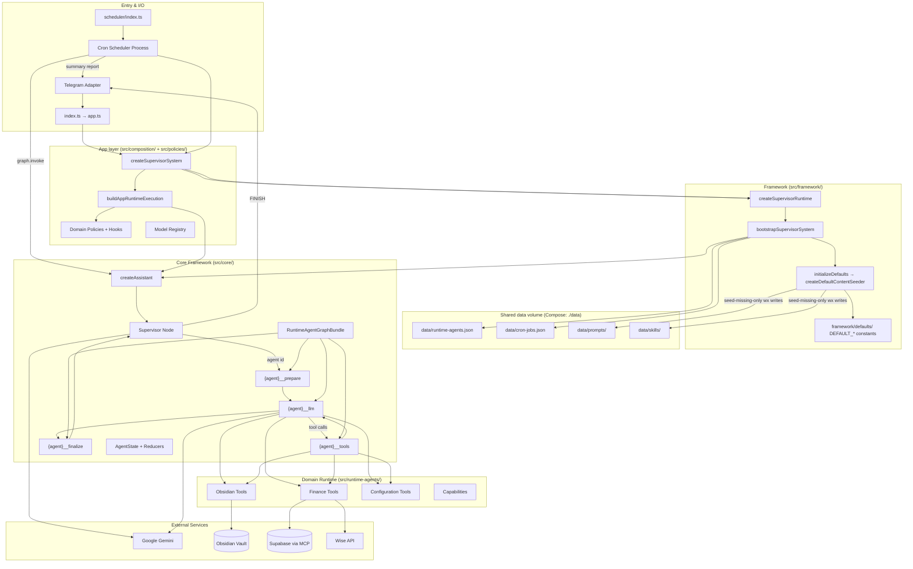
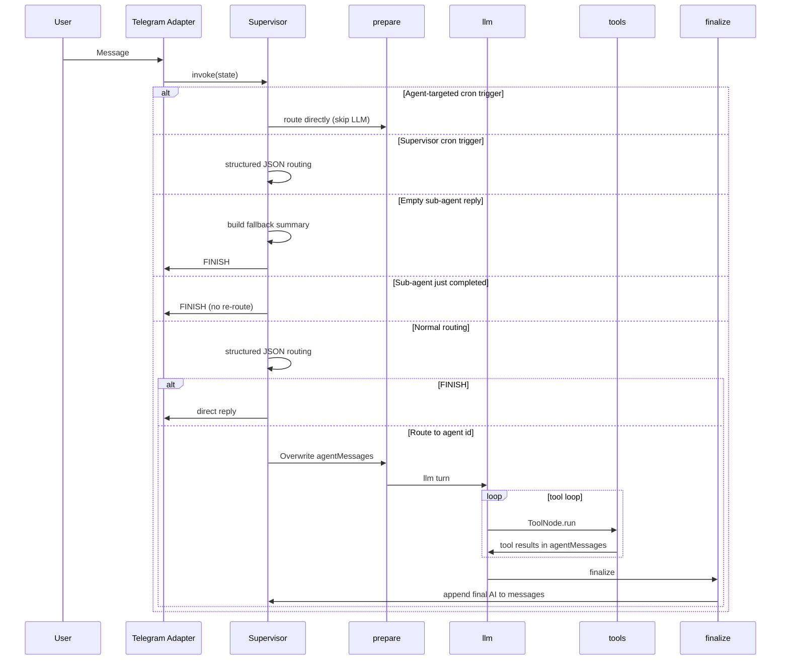

# Personal Assistant — Architecture Review

*Architecture reference for the personal-assistant deployment (July 2026).*

---

## Executive Summary

This is a single-user, Telegram-hosted personal assistant built on **LangGraph**. Its execution path is **Supervisor → per-agent prepare / llm ⇄ tools / finalize → Supervisor**. The codebase is deliberately split into three layers:

| Layer | Role |
|---|---|
| **`packages/supervisor-framework/`** | Execution kernel (graph, state, policies API, pack bootstrap) |
| **`apps/personal-assistant/src/composition/`** | Pack bootstrap, runtime execution wiring, model registry |
| **`apps/personal-assistant/src/policies/`** | Default runtime policy hooks and capability behaviors |
| **`apps/personal-assistant/src/runtime-agents/`** | Domain tools, capability providers, skill attachments |

The split makes domain behavior composable, but it has a real indirection cost for a single deployment. Treat `packages/supervisor-framework/` as an internal framework package, not a separately published product, until a second deployment outside this monorepo justifies npm release.

### Design constraints

- One trusted Telegram identity is enforced at the adapter boundary.
- The bot and scheduler are independently started processes; they do not share in-memory state.
- Runtime-agent and cron definitions are file-backed JSON, not a transactional shared database.
- The primary design goal is dependable personal automation, not multi-user tenancy or horizontal scaling.

These constraints are important when evaluating changes: persistence, tenancy, and distributed coordination are not free improvements for this application.

---

## System Topology



---

## Boot Sequence

The assistant runs as **two processes** that share the same workflow graph wiring via `createSupervisorSystem()`. **Single-writer discipline:** the Telegram bot is the sole writer to `./data`; the scheduler process is read-only for runtime-agent and cron JSON (mutating repository methods throw; bootstrap skips `initializeDefaults`).

### Telegram bot (`src/index.ts`) — data **writer**

```
index.ts
  └─ loadConfig()
  └─ createApp()
       └─ createSupervisorSystem()
            ├─ buildPersonalSupervisorPack({ dataWriteRole: "writer" }) — read/write repositories
            ├─ createSupervisorRuntime() — shared checkpointer, stable cron repo, serialized soft recompile
            │    └─ bootstrapSupervisorSystem()
            │         ├─ initializeDefaults() — seed missing supervisor/configuration prompts + configuration skills (atomic wx, opt-in)
            │         ├─ setupAdapters() — optional Supabase MCP (when configured)
            │         ├─ runtime agent repository + virtual configuration agent
            │         ├─ seedAgents() — load persisted specialists from data/runtime-agents.json
            │         ├─ buildSkillCatalog() — read data/skills/
            │         └─ createAssistant() — compile root graph from enabled agents
            ├─ GeminiConnector (supervisor model)
       ├─ TelegramAdapter (Telegraf long-polling)
       └─ launchApp()
```

### Scheduler process (`src/scheduler/index.ts`) — data **reader**

```
scheduler/index.ts
  └─ loadConfig()
  └─ createSchedulerApp()
       └─ createSupervisorSystem({ runtimeCron, dataWriteRole: "reader" }) — read-only repos; skips seeding/purge writes
       └─ startSchedulerRuntime() — wires framework cron runner + node-cron service
       └─ watchCronJobDefinitions() — hot-reload data/cron-jobs.json (framework)
       └─ launchScheduler() — blocks until SIGINT/SIGTERM
```

Cron jobs invoke the **same compiled graph** via the framework `createCronRunner()` with synthetic `SYSTEM_CRON_TRIGGER:<agentId>:<jobName>` messages, then post a user-facing summary back to Telegram via `telegram-cron-reporter.ts`. Generic cron mechanics (persistence, triggers, scheduling, reconciliation) live in `packages/supervisor-framework/src/framework/cron/`. The configuration agent persists job definitions; bot-side configuration does not schedule jobs in-process.

Startup and file-watcher reconciliation both register jobs through `RuntimeCronService`. The dedicated scheduler process honors `ENABLE_SCHEDULER`: when disabled it stays idle until shutdown instead of scheduling jobs.

Each process compiles its own graph instance at startup from enabled runtime agents: user agents from `data/runtime-agents.json` plus the virtual **configuration** agent injected from code. `createSupervisorRuntime()` reuses one checkpointer across soft recompiles within a process (SQLite on `state.db` when persistence is enabled, otherwise in-memory `MemorySaver`).

**Compile-time agent registry:** enabled runtime agents are wired into the root graph when `createAssistant()` runs. Adding or editing an agent via the configuration agent persists to JSON; the bot and scheduler **watch** `data/runtime-agents.json` via the framework `watchRuntimeAgentDefinitions()` helper and recompile graph nodes automatically when the fingerprint changes (enabled agents, model keys, capabilities, step limits).

Local dev: `pnpm dev` (Telegram bot), `pnpm dev:scheduler` (cron). Production Docker: `personal-assistant` + `personal-assistant-scheduler` services. Both processes expose `/health/live` and `/health/ready` on `HEALTH_PORT` (default 8080). Readiness turns true after bootstrap and graph compile; Compose health checks use readiness so wedged processes can restart. The scheduler acquires `data/.scheduler-lock` on the shared volume and exits if another scheduler is already running.

---

## Root LangGraph

Defined in `create-assistant.ts`. The supervisor is the only shared routing node; each enabled runtime agent gets four flat nodes on the **same** parent state (no nested `compiledSubgraph.invoke()`):

```
supervisor
  → {id}__prepare    # scope parent messages into agentMessages (Overwrite)
  → {id}__llm ⇄ {id}__tools
  → {id}__finalize   # merge final AI into messages, clear agentMessages
  → supervisor
```

Supervisor conditional edges route to `{id}__prepare` when `state.next === id`, or to `END` when `state.next === "FINISH"`.

Node sets are built at compile time by `buildRuntimeAgentGraphNodeSets()` from `config.runtimeAgents` and policy `createGraphBundle()` implementations.

**Why flat nodes:** nesting a compiled LangGraph inside a parent node (or calling `ToolNode.invoke()` from within a node) duplicates LangChain auto-injected `LangChainTracer` handlers and produces stderr noise (`No chain run to end`, etc.; [langchainjs#11189](https://github.com/langchain-ai/langchainjs/issues/11189)). The production graph avoids nested Runnable boundaries; tools use `ToolNode.run()` directly.

---

## Request Lifecycle



### Supervisor responsibilities

1. **Cron bypass** — agent-targeted `SYSTEM_CRON_TRIGGER:<agentId>:<jobName>` routes straight to that agent. `supervisor` cron triggers intentionally use normal supervisor routing.
2. **Empty sub-agent handoff** — when a runtime agent finishes with no user-facing text, the supervisor synthesizes a reply from bounded tool context (up to 2k chars, last 3 tool results).
3. **Completion detection** — a non-tool AI reply from a sub-agent short-circuits routing and goes to `FINISH`.
4. **Structured routing** — dynamic Zod schema built from enabled runtime agents; `FINISH` requires a `reply`, delegation omits it.

### Runtime agent loop responsibilities

At graph compile time, each enabled agent's policy produces a **`RuntimeAgentGraphBundle`**:

| Phase | Node | Purpose |
|---|---|---|
| **prepare** | `{id}__prepare` | Scope recent parent `messages` into `agentMessages` via `scopeSubAgentMessages`; reset `stepCount` |
| **llm** | `{id}__llm` | `createRuntimeAgentNode` — prompt assembly, tool binding, sanitization, recovery retry |
| **tools** | `{id}__tools` | Execute pending tool calls; results append to `agentMessages` only |
| **finalize** | `{id}__finalize` | Map sub-agent result to parent `messages` (typically last AI reply); clear `agentMessages` |

Policies differ in **tool resolution** and **optional LLM hooks** — the loop topology is shared. App-local capability behaviors live in `src/policies/`; domain tools live in `src/runtime-agents/{finance,obsidian}/`.

**Runtime agents** register through `buildAppRuntimeExecution()` with the generic policy and compose tools from grantable **capabilities** rather than hard-coded domain tool lists.

---

## Runtime Agent Loop (Shared Topology)

Every runtime agent shares the same **llm ⇄ tools** loop logic, wired as flat nodes on the parent graph:

```
{id}__prepare → {id}__llm → [{id}__tools ⇄ {id}__llm}]* → {id}__finalize
```

Key abstractions:

| Component | File | Purpose |
|---|---|---|
| `buildRuntimeAgentGraphNodeSets` | `agents/build-runtime-agent-nodes.ts` | Compile-time registry: prepare/llm/tools/finalize node names + routing helpers |
| `RuntimeAgentGraphBundle` | `agents/runtime-agent-graph-bundle.ts` | Policy output: prepare, llmNode, toolsNode, finalize, maxSteps |
| `createSubAgentGraphBundle` | `execution/create-sub-agent.ts` | Builds bundle from deps + hooks; shared tools node factory |
| `createRuntimeAgentNode` | `execution/runtime-node.ts` | LLM turn with hooks (prompt assembly, tool binding, sanitization) |
| `scopeSubAgentMessages` | `execution/sub-agent-messages.ts` | Scopes parent history for sub-agent context |
| `createCompiledSubAgentGraph` | `tests/helpers/compiled-sub-agent.ts` | **Unit tests only** — isolated compiled loop; do not mount under parent graph |
| Domain hooks | `policies/` | App-local capability behaviors (prompt enrichment, tool restrictions, result mapping) |

Tool execution uses `ToolNode.run()` (not `invoke()`) to avoid an extra Runnable boundary inside the parent graph node.

---

## State, Persistence, and Process Boundaries

### Root state shape (`AgentState`)

```typescript
export const createAgentStateAnnotation = ({ messageHistoryMaxTokens }) =>
  Annotation.Root({
    messages: Annotation<BaseMessage[]>({ reducer: reduceAgentMessages, ... }),
    agentMessages: Annotation<BaseMessage[]>({ reducer: reduceAgentMessages, ... }),
    stepCount: Annotation<number>({ reducer: (_left, right) => right, default: () => 0 }),
    next: Annotation<string | undefined>({ reducer: (_left, right) => right, ... }),
    context: Annotation<Record<string, unknown>>({ ... }),
  });
```

- **`messages`** — supervisor-visible conversation history; final sub-agent replies land here via finalize.
- **`agentMessages`** — scoped working set for the active runtime agent loop; cleared after finalize.
- **`stepCount`** — tool-loop iteration guard (compared to agent `maxSteps`).
- **`next`** — routing target: agent id (e.g. `finance`) or `FINISH`.

### Message reducer pipeline

Implemented across `state.ts`, `message-compaction.ts`, and `message-trimming.ts`:

```
messagesStateReducer → compactIntermediateToolHistory → trimMessagesToTokenBudgetSync(maxEstimatedTokens≈6000)
```

Two compaction strategies:

1. **Consumed tool markers** — after a completed tool round (AI tool-call → tool results → final non-tool AI reply), raw tool bodies are replaced with `[consumed: toolName]` while preserving LangChain message shape and tool-call IDs.
2. **Empty handoff cleanup** — after the supervisor resolves an empty sub-agent handoff, raw `toolContext` in `additional_kwargs` is replaced with a structural marker.

### Trimming rules

- Hard cap of **~6,000 estimated tokens** (configured via `MESSAGE_HISTORY_MAX_TOKENS` in `loadConfig()`, passed through `createSupervisorSystem()` into the message reducer; estimated as character length ÷ 4)
- Active in-flight tool sequences are kept as atomic units (may exceed the limit)
- Latest human message is never dropped
- Orphaned leading `ToolMessage`s are stripped

This is a practical balance between context-window cost and LangGraph conversation validity. It deliberately optimizes the live conversation only; it is not an audit log or durable memory system.

### Persistence boundaries

| State | Storage | Shared between bot and scheduler? | Consequence |
|---|---|---|---|
| Conversation checkpoints | SQLite `state.db` on shared volume (`PERSISTENCE_ENABLED`) | Yes (bot + scheduler read/write ledger; bot owns Telegram thread checkpoints) | Survives process restarts; cron threads use unique ids per run. |
| Cron run ledger | `cron_runs` in `state.db` | Yes | Cross-process overlap detection and execution history. |
| Runtime-agent definitions | `data/runtime-agents.json` | Yes (shared Compose volume) | **Bot writes; scheduler reads.** In-process write queues do not coordinate across processes; a second writer would require an advisory lock (see below). |
| Cron definitions | `data/cron-jobs.json` | Yes (shared Compose volume) | Same single-writer rule as runtime agents. Configuration mutations belong on the bot/Telegram path. |
| Skills and prompts | `data/skills/`, `data/prompts/` | Yes (shared Compose volume) | Git-tracked shipped files can be masked by an empty host mount; the pack's `initializeDefaults` hook seeds missing configuration baseline files from framework defaults before catalogs/prompt loaders run. Domain-specific finance/obsidian content is not auto-seeded. |

The file repositories validate data and runtime-agent writes use a temporary file plus rename. That protects against a partially written file, but it does not serialize two independent read-modify-write operations or provide cross-process transactions.

**Advisory lock fallback:** Phase 2 implements a scheduler singleton lock at `data/.scheduler-lock` so duplicate scheduler containers cannot double-fire cron jobs. If a second **writer** is ever required, coordinate JSON mutations with a separate lock file (e.g. `data/.write-lock`) before read-modify-write; Phase 1 enforces single-writer by role at the entrypoint instead.

### Deployment and ops (Phase 2)

| Concern | Mechanism | Notes |
|---|---|---|
| Liveness | `GET /health/live` | Always 200 once the HTTP server is listening. |
| Readiness | `GET /health/ready` | 503 until bootstrap + graph compile finish; used by Compose `healthcheck`. |
| Scheduler singleton | `acquireProcessLock` on `data/.scheduler-lock` | Second scheduler exits with an error; stale locks are reclaimed when the recorded pid is dead. |
| Logging | `getLogger()` / `setLogger()` | Console by default; optional append-only file logs under `LOG_DIR` (`logs/`). No rotation yet — mount `logs/` in Docker to persist across recreates. |

### Authorization (Phase 3)

| Concern | Mechanism | Notes |
|---|---|---|
| Grantability at load | `validatePersistedAgentCapabilities` during bootstrap/recompile | Hand-edited `runtime-agents.json` cannot grant non-grantable capabilities (e.g. `system-config`). Reserved map allows `finance` → `finance-domain`. |
| SQL read-only | `finance-domain-read` + MCP `read_only=true` | Custom agents get read SQL only; persisted `finance` agent keeps write capability via reserved exemption. |
| Destructive deletes | `confirmToken` on delete tools | Must match `delete-skill:{module}:{name}`, `delete-runtime-agent:{id}`, or `delete-cron-job:{jobName}`. |
| Telegram ingress | User id + chat id | `ALLOWED_TELEGRAM_USER_ID` and `ALLOWED_TELEGRAM_CHAT_ID` (defaults to user id for private chats). Cron delivery uses chat id. |

### Durability (Phase 4)

| Concern | Mechanism | Notes |
|---|---|---|
| Conversation checkpoints | SQLite `state.db` via LangGraph `SqliteSaver` | Telegram threads use `thread_id = chat id`; survives bot process restarts when `PERSISTENCE_ENABLED=true`. |
| Cron run ledger | `cron_runs` table in same DB | At-most-once overlap guard across scheduler processes; authoritative vs in-process `inFlightJobs`. |
| Scheduler singleton | `data/.scheduler-lock` | Kept as belt-and-suspenders; ledger is the primary overlap guard. |
| Single-writer exception | Scheduler writes ledger rows only | Phase 1 JSON/skill writes remain bot-only; ledger is execution metadata, not agent/cron definitions. |

---

## Runtime Agent Model

Agents are first-class persisted entities (`data/runtime-agents.json`):

```typescript
RuntimeAgentDefinitionSchema = z.object({
  id, name, description, systemPrompt,
  promptSourceKey?, capabilityIds, modelKey?,
  modelKey, maxSteps, enabled, createdAt, updatedAt,
});
```

### Code-seeded and persisted agents

The **configuration** system admin agent is virtual: defined via the framework `systemAgent` pack option, injected at bootstrap, and never written to `data/runtime-agents.json`. Finance, Obsidian, and other specialists are persisted in `data/runtime-agents.json` and are wired into the graph at compile time when enabled.

| ID | Model key | Typical max steps | Capability | Requires |
|---|---|---|---|---|
| `configuration` | `configuration` | 10 | `system-config` | Cron + runtime agent repos |
| `finance` | `finance` | 10 | `finance-domain` | Supabase MCP |
| `obsidian` | `obsidian` | 12 | `obsidian-vault` | Vault path |

Persisted specialists optionally set `modelKey` for dedicated chat models. Tools and optional LLM hooks come from grantable **capabilities**.

---

## Runtime Policy Pattern

At bootstrap the app pack registers one **default** runtime policy via `buildAppRuntimeExecution()`. Capability-specific LLM hooks (Obsidian vault context, blank-reply recovery; configuration unavailable-gate and completion summaries) live in `src/policies/` (and framework system-agent definition hooks) and compose when matching capabilities are granted. `bootstrapSupervisorSystem()` passes a single `runtimeAgentPolicy` to `createAssistant()` — the virtual configuration agent uses the same builder.

Each policy implements:

```typescript
type RuntimeAgentPolicy = {
  createGraphBundle: (context, definition) => RuntimeAgentGraphBundle;
};
```

`createAssistant()` calls `createGraphBundle()` for each enabled agent at compile time and registers the returned node functions on the root graph. The generic policy resolves tools from `capabilityIds` and optionally composes capability-specific hooks — the loop topology is shared. Domain tools live in `src/runtime-agents/{finance,obsidian}/`; Obsidian hooks live alongside tools in `runtime-agents/obsidian/hooks.ts`; the policy registry in `runtime-agent-policy.ts` selects behaviors by capability id.

---

## Default Content Bootstrap

Generic supervisor/configuration baseline content lives in the framework package (`packages/supervisor-framework/src/framework/defaults/`). Packs opt in; the framework never writes files unless a pack registers `initializeDefaults`.

| Component | Location | Role |
|---|---|---|
| `DEFAULT_*` constants | `framework/defaults/*.ts` | Domain-agnostic supervisor prompt, configuration prompt, and four configuration skills (`cron`, `runtime-agents`, `skill-management`, `skill-bootstrap`) |
| `createDefaultContentSeeder()` | `framework/defaults/create-default-content-seeder.ts` | Atomic seed-missing-only writer (`flag: "wx"`, ignore `EEXIST`) for six files |
| `initializeDefaults` hook | `SupervisorPackBootstrap` | Invoked at the start of `bootstrapSupervisorSystem()`, before repositories, `seedAgents`, prompt loaders, or skill catalogs |

Personal-assistant registers the hook in `buildPersonalSupervisorPack()`:

```typescript
initializeDefaults: () => {
  personalDefaultContentSeeder.seedAll(); // data/prompts + data/skills
}
```

**Seeded when missing:** `supervisor.xml`, `configuration.xml`, `cron.xml`, `runtime-agents.xml`, `skill-management.xml`, `skill-bootstrap.xml`.

**Not auto-seeded:** domain prompts (`finance.xml`, `obsidian.xml`) and domain skills (`expense-*`, `finance-summary`, `daily-routine-note-creation`). Those remain git-tracked app content.

Only the **bot** (writer role) runs `initializeDefaults` on bootstrap; the scheduler (reader role) skips those writes and uses read-only repository wrappers. On first deploy, start the bot once (or ensure the writer process boots first) so framework defaults seed into `./data` before the scheduler reads them.

---

## Skills System

Flat skill store with XML playbooks (and optional `.md`):

| Layer | Path | Role |
|---|---|---|
| Skills | `data/skills/*.xml` | Product playbooks (image + git; writable via Compose volume) |

- Each skill has `name`, `module`, `description`
- `module` controls which runtime agent can attach/use the skill (`finance`, `obsidian`, `configuration`, …)
- Configuration agent writes via `create_skill` / `edit_skill` → `data/skills/{name}.xml`
- **Auto-seed on boot:** if configuration skills are missing, the pack's `initializeDefaults` hook writes domain-agnostic defaults via `createDefaultContentSeeder()` before repositories and catalogs load. Existing files are never overwritten.
- Optional `<skill_attachments>` for phrase/cron auto-attachment
- Configuration agent has full CRUD; execution agents get `read_skill`
- Skills are injected into system prompts dynamically (appended at bottom for LLM cache efficiency)
- `packages/supervisor-framework/src/core/skills/skills-loader.ts` — filesystem read/write/parse; `packages/supervisor-framework/src/core/skills/skill-catalog.ts` — `createSkillCatalog()` implementing the framework `SkillCatalog` interface

Current shipped skills: `cron`, `daily-routine-note-creation`, `expense-ledger-schema`, `expense-sync`, `expense-update`, `expense-view`, `finance-summary`, `runtime-agents`, `skill-bootstrap`, `skill-management`.

---

## Prompt Architecture

| Agent | Source | Format |
|---|---|---|
| Supervisor | `data/prompts/supervisor.xml` | XML |
| Finance | `data/prompts/finance.xml` | XML |
| Obsidian | `data/prompts/obsidian.xml` | XML |
| Configuration | `data/prompts/configuration.xml` | XML |
| Chat-created runtime agents | `data/prompts/{id}.xml` | XML (writable data volume) |

Prompts are **read from disk on each invocation** (hot-reload in dev). Agents with `promptSourceKey` store a bootstrap snapshot in JSON; the prompt file under `data/prompts/` is the runtime source of truth. Static domain rules come first; dynamic context (timestamps, vault tree, attached skills) is appended via hooks.

**Auto-seed on boot:** if `supervisor.xml` or `configuration.xml` are missing from `data/prompts/`, the pack's `initializeDefaults` hook writes domain-agnostic defaults via `createDefaultContentSeeder()` before prompt loaders run. Existing files are never overwritten. Domain prompts (`finance.xml`, `obsidian.xml`) are not auto-seeded.

---

## External Integrations

| Service | Access Pattern | Location |
|---|---|---|
| **Google Gemini** | `GeminiConnector` + per-agent model registry | `models/`, `composition/model-registry.ts` |
| **Telegram** | Telegraf long-polling, MarkdownV2 formatting, file send | `telegram/` |
| **Obsidian vault** | Local filesystem read/write | `integrations/obsidian.ts`, `runtime-agents/obsidian/tools.ts` |
| **Supabase** | Hosted MCP session with transport-error reconnect | `integrations/mcp/supabase.ts`, `integrations/mcp/self-healing-session.ts`, `integrations/supabase.ts` |
| **Wise** | REST API for transaction sync | `integrations/wise.ts` |
| **Cron** | Separate scheduler process; framework cron kit + app Telegram wiring | `packages/supervisor-framework/src/framework/cron/`, `apps/personal-assistant/src/scheduler/`, `data/cron-jobs.json` |

Finance gracefully degrades: if Supabase is unconfigured, the finance agent is disabled at bootstrap and the policy returns a stub message rather than crashing.

### Supabase MCP self-healing

When credentials are present, `setupSupabaseSessions()` wraps each raw MCP client (read and write) in `createSelfHealingMcpSession()`. Transport failures classified by `isMcpTransportError()` (connection resets, socket hang-ups, etc.) trigger reconnect attempts with optional exponential backoff before surfacing the error to finance tools.

Configurable via `MCP_MAX_RECONNECT_ATTEMPTS` (default `1`), `MCP_RECONNECT_BASE_DELAY_MS` (default `0` — immediate first reconnect), and `MCP_RECONNECT_MAX_DELAY_MS` (default `5000`). When `baseDelayMs` is `0`, behavior matches the original single immediate retry. Operators can increase attempts and delay when Supabase MCP outages are observed (e.g. `MCP_RECONNECT_BASE_DELAY_MS=500`, `MCP_MAX_RECONNECT_ATTEMPTS=3`).

---

## Intentional layer boundaries

These paths look thin or product-specific but should **stay separate**. Do not merge them without a concrete second-deployment need.

| Path | Role | Why keep separate |
|---|---|---|
| `packages/supervisor-framework/` | Pack bootstrap (`bootstrapSupervisorSystem`), default content (`createDefaultContentSeeder`, `DEFAULT_*`) | Generic orchestration; workspace package for reuse |
| `apps/personal-assistant/src/runtime-agents/resolve-tools.ts` | Personal `read_skill` + catalog resolution | Wraps framework `resolveAgentTools()` for personal policies |
| `src/app.ts` | Telegram process bootstrap | Entry module only — not a source folder; sibling to `src/scheduler/index.ts` |
| `src/composition/` + `src/policies/` vs `src/runtime-agents/` | Wiring vs domain tools | Composition/policies import runtime-agents only; runtime-agents must not import them (enforced in tests) |
| `src/scheduler/` | Scheduler process entry + Telegram wiring | Separate Docker service; generic cron in framework |
| `src/integrations/supabase.ts` | Supabase MCP setup | Self-healing session + config guards, not a one-liner |
| `src/ports/file-sender.ts` | File delivery port | Domain tools depend on the port; Telegraf impl in `telegram/` |

---

## Directory Map

```
personal-assistant/                 # pnpm workspace root
├── packages/
│   └── supervisor-framework/       # @personal-assistant/supervisor-framework
│       ├── src/core/               # Execution kernel
│       ├── src/framework/          # bootstrapSupervisorSystem, defaults/, resolveAgentTools
│       ├── src/capabilities/
│       └── tests/unit/             # Framework boundary + kernel tests
├── apps/
│   └── personal-assistant/
│       ├── src/
│       │   ├── index.ts, app.ts, config.ts
│       │   ├── composition/        # Pack bootstrap & runtime execution wiring
│       │   ├── policies/           # Capability behavior registry
│       │   ├── runtime-agents/     # Domain folders (finance/, obsidian/), capabilities, resolve-tools
│       │   ├── ports/ integrations/ scheduler/ telegram/ models/ prompts/ ...
│       ├── data/prompts/ data/skills/ data/ sql/
│       ├── tests/unit/{composition,policies,domains,integrations,processes}/
│       └── Dockerfile docker-compose.yml
├── docs/ examples/
└── pnpm-workspace.yaml
```

---

## Testing Posture

- Unit tests cover graph topology, state reducers, compaction, supervisor routing, runtime agent loops, cron, skills, MCP self-healing, and domain tools
- **Framework** supervisor/routing/callback tests live in `packages/supervisor-framework/tests/unit/`
- **App** tests mirror layers under `tests/unit/{composition,policies,domains,integrations,processes}/`
- **E2E** via Playwright (`tests/e2e/workflow.spec.ts`)
- Test helpers mirror production wiring (`tests/helpers/workflow-graph.ts`, `runtime-execution-context.ts`)
- `pnpm check` for TypeScript; `pnpm test:unit` / `pnpm test:e2e`

The core framework (`state`, `message-trimming`, `supervisor`, `build-runtime-agent-nodes`, `create-sub-agent`, `runtime-agent-handoff`) has dedicated test coverage, which is appropriate given its complexity.

---

## What Is Working Well

1. **Shared execution topology (DRY)** — all domains use one graph-bundle factory; policies customize tools and prompt hooks instead of copying graphs.
2. **Data-driven routing** — built-in and custom agents share one schema, and the supervisor schema is derived from enabled agents.
3. **Useful failure boundaries** — unavailable finance integration disables that capability; routing and empty-handoff failures return a user-facing response.
4. **Deliberate context control** — trimming and tool-result compaction address a genuine LLM-cost and message-validity problem.
5. **Flat root graph for tracing correctness** — runtime agent loops are parent-graph nodes (prepare/llm/tools/finalize), not nested compiled subgraphs, avoiding LangSmith tracer duplication under `LANGCHAIN_TRACING_V2`.

---

## Architecture Debt and Recommended Decisions

### Improve when reliability requirements increase

| Finding | Why it matters | Recommendation |
|---|---|---|
| **Conversation state is in memory** | Process restarts lose conversation state; the two processes cannot see each other's checkpoints. | **Addressed in Phase 4:** optional SQLite checkpointer on `data/state.db`. Set `PERSISTENCE_ENABLED=false` to revert to in-memory `MemorySaver`. |
| **Cron execution is at-least-once only operationally** | A process restart, duplicate scheduler deployment, or failed delivery can create duplicate or untracked executions. | **Addressed in Phase 4:** `cron_runs` ledger with running-job unique index. Scheduler singleton lock retained as secondary guard. |
| **MCP recovery uses configurable backoff** | Transport errors trigger reconnect with optional exponential delay; defaults preserve one immediate retry. | Tune `MCP_RECONNECT_*` env vars when outages are observed; add circuit-breaking only if backoff is insufficient. |
| **Prompts and skills are read from disk during execution** | This is convenient for local iteration but means concurrent file edits can change behavior between turns. | Keep it in development. For production, deploy immutable prompt/skill artifacts or reload them explicitly at a controlled boundary. |

### Defer unless product scope changes

| Proposal | Why it is premature today |
|---|---|
| **Database-backed event log and long-term memory** | The application has one trusted user and Telegram remains the source of visible message history. Add it only for recall, audit, or restart-continuity requirements that cannot be met otherwise. |
| **Multi-user tenancy and role-based authorization** | The current adapter is intentionally single-user. A generic-agent capability model is needed before opening access to additional users, not before. |
| **Publishing `@personal-assistant/supervisor-framework` to npm** | The core already lives in a private workspace package (`packages/supervisor-framework/`). Defer **npm publish and semver compatibility** until a second deployment outside this monorepo justifies it. |
| **More graph nodes or a workflow engine** | The supervisor plus per-agent flat nodes are already explicit. Add graph structure only for a durable business workflow that cannot fit a runtime-agent tool loop. |

### Capability boundary for custom agents

Custom agents are restricted to allowlisted bundles, which is a good starting point. However, the available bundles include `system-config` and `finance-domain`; a custom agent with either bundle is intentionally powerful. This is acceptable for the one trusted Telegram user, but it is not a safe multi-user authorization model. Before any user expansion, separate read-only and mutating bundles, attach a capability policy to each agent, and require confirmation for externally visible or destructive actions.

### Simplification opportunities

---

## Extension Guide (Quick Reference)

**Add a new tool domain (rare — most agents use chat create):**

1. Implement tools under `runtime-agents/<domain>/tools.ts` (and optional `hooks.ts`)
2. Add capability descriptor + provider in `runtime-agents/capabilities.ts`
3. Compose capability behavior in `policies/runtime-agent-policy.ts` when that capability is granted
4. Seed a persisted agent row with matching `capabilityIds` and add a prompt under `data/prompts/` (optional `promptSourceKey`)
5. Restart scheduler once if cron jobs will target the new agent id

**Add a custom runtime agent at runtime (default):**

Use the configuration agent in Telegram — creates an agent with selected capabilities, persists metadata to `data/runtime-agents.json`, and writes the runtime prompt to `data/prompts/{id}.xml`. **Soft recompile** (file watcher, ~seconds) adds routable graph nodes without a manual restart.

---

## Summary

The execution architecture keeps routing simple: a supervisor delegates to compile-time-registered runtime agents, and every domain shares the same flat prepare/llm/tools/finalize loop. That is a good KISS/DRY trade-off for this assistant. The more sophisticated parts—token budgeting, tool-result compaction, empty-handoff recovery, and flat graph topology for LangSmith tracing—address concrete LangGraph and LLM constraints rather than speculative extensibility.

The immediate priority is operational clarity around the shared `./data` Compose volume: runtime JSON, prompts, and skills all live there, with framework-managed seed-missing-only defaults for the configuration baseline. Introduce durability, distributed coordination, or tenancy only in response to a concrete product requirement.
