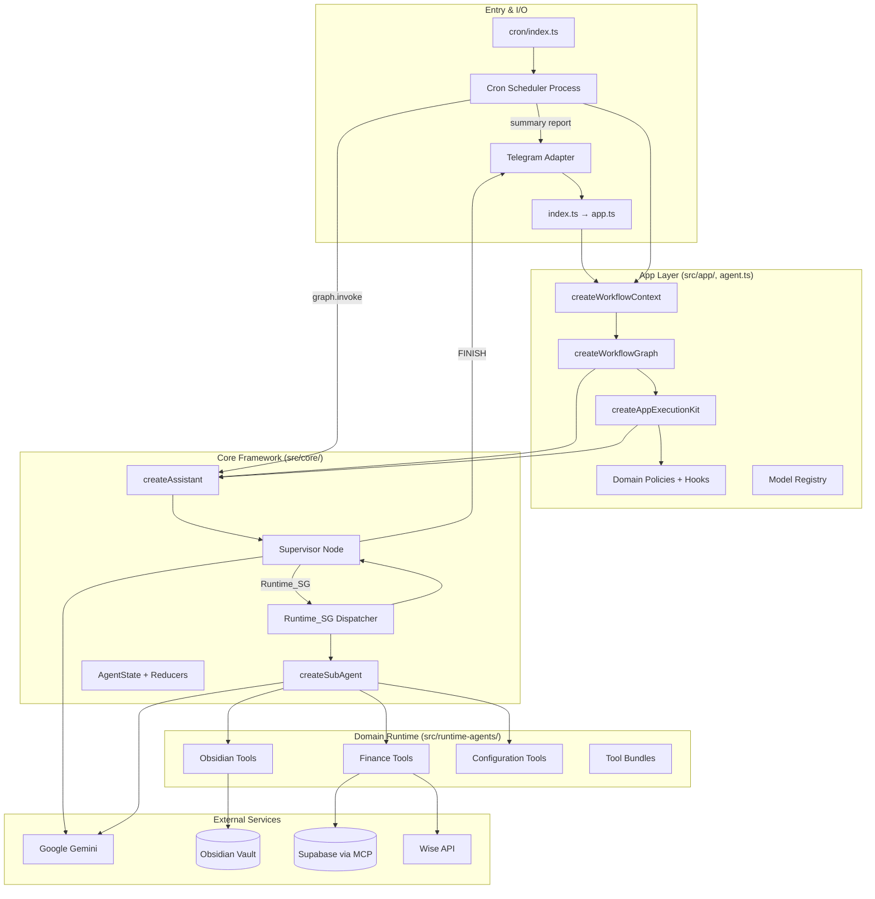
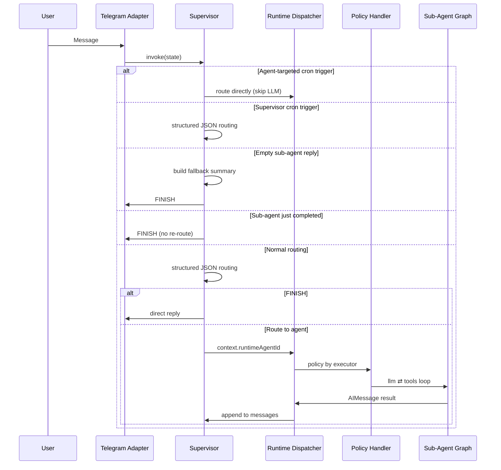

# Personal Assistant — Architecture Review

*Implementation review as of July 2026, based on the current codebase (~79 source files and 44 unit test files). This document describes verified behavior and separates current defects from conditional future work.*

---

## Executive Summary

This is a single-user, Telegram-hosted personal assistant built on **LangGraph**. Its execution path is **Supervisor → runtime-agent dispatcher → nested sub-agent tool loop**. The codebase is deliberately split into three layers:

| Layer | Role |
|---|---|
| **`src/core/`** | Reusable assistant framework (graph, state, policies API, sub-agent factory) |
| **`src/app/`** | This deployment's wiring (domain policies, LLM hooks, model registry) |
| **`src/runtime-agents/`** | Domain tools, tool bundles, built-in agent specs |

The split makes domain behavior composable, but it has a real indirection cost for a single deployment. Treat `src/core/` as an internal framework, not a separately reusable product, until a second deployment has concrete requirements that justify a package boundary.

### Design constraints

- One trusted Telegram identity is enforced at the adapter boundary.
- The bot and scheduler are independently started processes; they do not share in-memory state.
- Runtime-agent and cron definitions are file-backed JSON, not a transactional shared database.
- The primary design goal is dependable personal automation, not multi-user tenancy or horizontal scaling.

These constraints are important when evaluating changes: persistence, tenancy, and distributed coordination are not free improvements for this application.

---

## System Topology



---

## Boot Sequence

The assistant runs as **two processes** that share the same workflow graph wiring via `createWorkflowContext()`:

### Telegram bot (`src/index.ts`)

```
index.ts
  └─ loadConfig()
  └─ createApp()
       └─ createWorkflowContext()
            ├─ GeminiConnector (supervisor model)
            ├─ setupSupabaseSession() — optional, wrapped in self-healing MCP session
            ├─ Runtime agent repository (data/runtime-agents.json)
            ├─ ensureBuiltinRuntimeAgents() — merge persisted + built-ins
            ├─ createWorkflowGraph() → createAssistant()
       ├─ TelegramAdapter (Telegraf long-polling)
       └─ launchApp()
```

### Cron scheduler (`src/cron/index.ts`)

```
cron/index.ts
  └─ loadConfig()
  └─ createSchedulerApp()
       └─ createWorkflowContext({ runtimeCron: lazyCron })
       └─ startCron() — node-cron + cron job bootstrap
       └─ watchCronJobDefinitions() — hot-reload data/cron-jobs.json
       └─ launchScheduler() — blocks until SIGINT/SIGTERM
```

Cron jobs invoke the **same compiled graph** directly (`cron-runner.ts`) with synthetic `SYSTEM_CRON_TRIGGER:<agentId>:<jobName>` messages, then post a user-facing summary back to Telegram via `telegram-cron-reporter.ts`. The configuration agent persists job definitions; bot-side configuration does not schedule jobs in-process.

Startup and file-watcher reconciliation both register jobs through `RuntimeCronService`. The dedicated scheduler process honors `ENABLE_SCHEDULER`: when disabled it stays idle until shutdown instead of scheduling jobs.

Each process compiles its own graph instance at startup. Invocations use a thread-scoped in-memory checkpointer (`MemorySaver`); conversation state is lost whenever that process restarts.

Local dev: `pnpm dev` (Telegram bot), `pnpm dev:scheduler` (cron). Production Docker: `personal-assistant` + `personal-assistant-scheduler` services.

---

## Root LangGraph

Defined in `create-assistant.ts`:

```typescript
const graph = new StateGraph(AgentStateAnnotation)
  .addNode("supervisor", supervisorNode)
  .addNode("Runtime_SG", runtimeAgentDispatcher);

graph
  .addEdge(START, "supervisor")
  .addConditionalEdges(
    "supervisor",
    (state: AgentState) => state.next ?? "FINISH",
    {
      Runtime_SG: "Runtime_SG",
      FINISH: END,
    },
  );

graph.addEdge("Runtime_SG", "supervisor");
```

Only **two graph nodes** at the root level. All domain complexity lives in nested sub-graphs compiled inside policy handlers.

---

## Request Lifecycle



### Supervisor responsibilities

1. **Cron bypass** — agent-targeted `SYSTEM_CRON_TRIGGER:<agentId>:<jobName>` routes straight to that agent. `Supervise_SG` triggers intentionally use normal supervisor routing.
2. **Empty sub-agent handoff** — when a runtime agent finishes with no user-facing text, the supervisor synthesizes a reply from bounded tool context (up to 2k chars, last 3 tool results).
3. **Completion detection** — a non-tool AI reply from a sub-agent short-circuits routing and goes to `FINISH`.
4. **Structured routing** — dynamic Zod schema built from enabled runtime agents; `FINISH` requires a `reply`, delegation omits it.

### Dispatcher responsibilities

- Reads `context.runtimeAgentId`
- Loads agent definition from repository
- Resolves system prompt via `PromptResolver`
- Selects policy by `executor` (`finance`, `obsidian`, `configuration`, `generic`)
- Caches policy handlers per executor (or per generic agent revision)

---

## Sub-Agent Pattern

Every runtime agent runs the same nested topology via `createSubAgent()`:

```
START → llm → [tools ⇄ llm]* → END
         ↑         ↑
    maxSteps    ToolNode
    guard       (LangGraph prebuilt)
```

Key abstractions:

| Component | File | Purpose |
|---|---|---|
| `createSubAgent` | `execution/create-sub-agent.ts` | Compiles nested graph, wraps as root node |
| `createRuntimeAgentNode` | `execution/runtime-node.ts` | LLM turn with hooks (prompt assembly, tool binding, sanitization) |
| `createSubgraphNodeWrapper` | `execution/subgraph-wrapper.ts` | Maps sub-state → parent `AgentStateUpdate` |
| `scopeSubAgentMessages` | `execution/sub-agent-messages.ts` | Scopes parent history for sub-agent context |
| Domain hooks | `app/policies/*-hooks.ts` | Per-domain prompt enrichment, tool restrictions, result mapping |

**Generic agents** (user-created via configuration) use `createGenericPolicy()` and compose tools from allowlisted **tool bundles** rather than hard-coded domain tools.

---

## State, Persistence, and Process Boundaries

### Root state shape (`AgentState`)

```typescript
export const AgentStateAnnotation = Annotation.Root({
  messages: Annotation<BaseMessage[]>({
    reducer: reduceAgentMessages,
    default: () => [],
  }),
  next: Annotation<RouteName | undefined>({
    reducer: (_left, right) => right,
    default: () => undefined,
  }),
  context: Annotation<Record<string, unknown>>({
    reducer: (left, right) => ({ ...left, ...right }),
    default: () => ({}),
  }),
});
```

### Message reducer pipeline

Implemented across `state.ts`, `message-compaction.ts`, and `message-trimming.ts`:

```
messagesStateReducer → compactIntermediateToolHistory → trimMessagesToTokenBudgetSync(maxEstimatedTokens≈6000)
```

Two compaction strategies:

1. **Consumed tool markers** — after a completed tool round (AI tool-call → tool results → final non-tool AI reply), raw tool bodies are replaced with `[consumed: toolName]` while preserving LangChain message shape and tool-call IDs.
2. **Empty handoff cleanup** — after the supervisor resolves an empty sub-agent handoff, raw `toolContext` in `additional_kwargs` is replaced with a structural marker.

### Trimming rules

- Hard cap of **~6,000 estimated tokens** (configured via `MESSAGE_HISTORY_MAX_TOKENS` in `loadConfig()`, passed through `createWorkflowContext()` into the message reducer; estimated as character length ÷ 4)
- Active in-flight tool sequences are kept as atomic units (may exceed the limit)
- Latest human message is never dropped
- Orphaned leading `ToolMessage`s are stripped

This is a practical balance between context-window cost and LangGraph conversation validity. It deliberately optimizes the live conversation only; it is not an audit log or durable memory system.

### Persistence boundaries

| State | Storage | Shared between bot and scheduler? | Consequence |
|---|---|---|---|
| Conversation checkpoints | Per-process `MemorySaver` | No | Restarts drop context; cron cannot use bot conversation state. |
| Runtime-agent definitions | `data/runtime-agents.json` | Yes (shared Compose volume) | Concurrent read-modify-write updates can still lose changes across processes; writes are serialized within each process. |
| Cron definitions | `data/cron-jobs.json` | Yes (shared Compose volume) | Same concurrency constraint as runtime agents. |
| Skills and prompts | Local files | No database coordination | Changes take effect on the next load; deployment paths must match source expectations. |

The file repositories validate data and runtime-agent writes use a temporary file plus rename. That protects against a partially written file, but it does not serialize two independent read-modify-write operations or provide cross-process transactions.

---

## Runtime Agent Model

Agents are first-class persisted entities (`data/runtime-agents.json`):

```typescript
RuntimeAgentDefinitionSchema = z.object({
  id, name, description, systemPrompt,
  promptSourceKey?, toolBundleIds, executor, modelKey?,
  builtin, maxSteps, enabled, createdAt, updatedAt,
});
```

### Built-in domains

| ID | Executor | Max Steps | Tool Bundle | Requires |
|---|---|---|---|---|
| `finance` | `finance` | 10 | `finance-domain` | Supabase MCP |
| `obsidian` | `obsidian` | 12 | `obsidian-vault` | Vault path |
| `configuration` | `configuration` | 10 | `system-config` | Cron + runtime agent repos |

Custom agents use `executor: "generic"` and select from the tool bundle catalog (`none`, `obsidian-vault`, `finance-domain`, `system-config`). Built-in domain policies have direct tool factories; their `toolBundleIds` describe the corresponding capability but are not their runtime tool-resolution path. Keep those two definitions aligned when adding a domain.

---

## Policy Registry Pattern

Policies are registered at app bootstrap in `src/app/register-defaults.ts`:

```typescript
DOMAIN_POLICY_FACTORIES = {
  finance: createFinancePolicy,
  obsidian: createObsidianPolicy,
  configuration: createConfigurationPolicy,
};
```

Each policy implements:

```typescript
type RuntimeAgentPolicy = {
  readonly executor: string;
  createHandler: (context, definition) => RuntimeAgentPolicyHandler;
};
```

Domain policies differ mainly in **deps**, **tool factories**, and **LLM node hooks** — the graph topology is shared. The ownership boundary is intentional: `src/app/policies/` contains policy handlers and hooks, `src/runtime-agents/policies/<domain>/` contains domain tools, and `src/core/policies/generic.ts` resolves allowlisted bundles for configurable agents.

---

## Skills System

Flat `skills/` directory with XML playbooks (and optional `.md`):

- Each skill has `name`, `module`, `description`
- `module` controls which runtime agent can attach/use the skill
- Optional `<skill_attachments>` for phrase/cron auto-attachment
- Configuration agent has full CRUD; execution agents get `read_skill`
- Skills are injected into system prompts dynamically (appended at bottom for LLM cache efficiency)

Current skills: `sync-expenses`, `daily-routine-note-creation`, `cron`, `runtime-agents`, `skill-management`.

---

## Prompt Architecture

| Agent | Source | Format |
|---|---|---|
| Supervisor | `prompts/supervisor.xml` | XML |
| Finance | `prompts/finance.xml` | XML |
| Obsidian | `prompts/obsidian.xml` | XML |
| Configuration | `prompts/configuration.xml` | XML |

Prompts are **read from disk on each invocation** (hot-reload in dev). For built-ins with `promptSourceKey`, the persisted `systemPrompt` is a bootstrap snapshot and the prompt file is the runtime source of truth. Static domain rules come first; dynamic context (timestamps, vault tree, attached skills) is appended via hooks.

---

## External Integrations

| Service | Access Pattern | Location |
|---|---|---|
| **Google Gemini** | `GeminiConnector` + per-agent model registry | `connectors/`, `app/model-registry.ts` |
| **Telegram** | Telegraf long-polling, MarkdownV2 formatting, file send | `telegram/` |
| **Obsidian vault** | Local filesystem read/write | `services/obsidian.ts`, vault tools |
| **Supabase** | Hosted MCP session with transport-error reconnect | `mcp/supabase.ts`, `mcp/self-healing-session.ts`, `services/supabase.ts` |
| **Wise** | REST API for transaction sync | `mcp/wise.ts`, `services/wise/` |
| **Cron** | Separate scheduler process (`node-cron`), JSON persistence, Telegram reporting | `cron/`, `cron-triggers.ts`, `data/cron-jobs.json` |

Finance gracefully degrades: if Supabase is unconfigured, the finance agent is disabled at bootstrap and the policy returns a stub message rather than crashing.

### Supabase MCP self-healing

When credentials are present, `setupSupabaseSession()` wraps the raw MCP client in `createSelfHealingMcpSession()`. Transport failures classified by `isMcpTransportError()` (connection resets, socket hang-ups, etc.) trigger a single reconnect attempt before surfacing the error to finance tools.

---

## Directory Map

```
personal-assistant/
├── src/
│   ├── index.ts, app.ts, agent.ts, config.ts, cron-triggers.ts  # Bootstrap & wiring
│   ├── core/                                       # Framework (reusable)
│   │   ├── create-assistant.ts                     # Main graph API
│   │   ├── state.ts, message-compaction.ts, message-trimming.ts  # State + trimming
│   │   ├── supervisor/                             # Routing, history sanitization
│   │   ├── agents/                                 # Dispatch, repository, prompts
│   │   ├── execution/                              # Sub-agent factory, runtime node
│   │   ├── policies/                               # Registry, generic policy
│   │   └── types/                                  # Agent & policy schemas
│   ├── app/                                        # This assistant's config
│   │   ├── register-defaults.ts, workflow-context.ts
│   │   ├── policies/                               # Domain policies + hooks
│   │   ├── model-registry.ts
│   │   └── runtime-agent-catalog.ts
│   ├── runtime-agents/                             # Domain tools & specs
│   │   ├── builtin-domains.ts
│   │   ├── tool-bundles.ts, tool-bundle-catalog.ts
│   │   ├── policies/{finance,obsidian,configuration}/
│   │   └── bootstrap.ts
│   ├── cron/                                       # Scheduler subsystem (+ cron/index.ts entry)
│   ├── telegram/                                   # I/O adapter + cron reporter
│   ├── tools/                                      # Shared tools (skills, routing)
│   ├── prompts/                                    # Prompt & skill loading
│   ├── services/                                   # Obsidian, Supabase, Wise
│   ├── mcp/                                        # MCP client wrappers + self-healing
│   ├── connectors/                                 # LLM connector abstraction
│   └── utils/                                      # Message content, FS, SQL, datetime
├── prompts/          # System prompt files
├── skills/           # Agent playbooks
├── data/             # Persisted cron jobs + runtime agents
├── specs/            # Pointer to docs/ARCHITECTURE.md (legacy specs retired)
├── tests/unit/       # 44 Vitest suites
├── tests/e2e/        # Playwright workflow tests
└── sql/              # Supabase setup scripts
```

---

## Testing Posture

- **44 unit test files** covering graph topology, state reducers, compaction, token-budget trimming, supervisor routing, sub-agent behavior, cron, skills, MCP self-healing, and domain tools
- **E2E** via Playwright (`tests/e2e/workflow.spec.ts`)
- Test helpers mirror production wiring (`tests/helpers/workflow-graph.ts`, `runtime-execution-context.ts`)
- `pnpm check` for TypeScript; `pnpm test:unit` / `pnpm test:e2e`

The core framework (`state`, `message-trimming`, `supervisor`, `create-sub-agent`, `empty-subagent-handoff`) has dedicated test coverage, which is appropriate given its complexity.

---

## What Is Working Well

1. **Shared execution topology (DRY)** — all domains use one sub-agent factory; policies customize tools and prompt hooks instead of copying graphs.
2. **Data-driven routing** — built-in and custom agents share one schema, and the supervisor schema is derived from enabled agents.
3. **Useful failure boundaries** — unavailable finance integration disables that capability; routing and empty-handoff failures return a user-facing response.
4. **Deliberate context control** — trimming and tool-result compaction address a genuine LLM-cost and message-validity problem.
5. **Small, explicit root graph (KISS)** — the root graph has only the supervisor and dispatcher. Domain work remains in the runtime policy layer.

---

## Architecture Debt and Recommended Decisions

### Fix now: deployment contracts

| Finding | Status |
|---|---|
| **Skills unavailable in production Compose** | **Done** — production image copies `skills/` to `/app/skills`. Compose does not bind-mount skills by default, so baked-in playbooks are used unless the operator adds an override mount. |
| **Bot and scheduler do not share persisted definitions** | **Done** — both services mount `./data` at `/app/data`. |
| **Scheduler flag misleading in deployed scheduler** | **Done** — scheduler honors `ENABLE_SCHEDULER`; when disabled it idles until shutdown (avoids Compose restart loops). |
| **Cron uses two independent task registries** | **Done** — bootstrap and file reconciliation both use `RuntimeCronService`; reconcile updates changed schedules in place. |
| **Configuration writes are not coordinated** | **Done (in-process)** — runtime-agent and cron repositories serialize read-modify-write mutations per file within each process via `createJob`/`deleteJob` and repository CRUD. Cross-process file locking remains deferred. |

### Improve when reliability requirements increase

| Finding | Why it matters | Recommendation |
|---|---|---|
| **Conversation state is in memory** | Process restarts lose conversation state; the two processes cannot see each other's checkpoints. | Keep `MemorySaver` for a disposable personal bot. Introduce a persistent LangGraph checkpointer only when restart continuity or shared process state is a stated requirement. |
| **Cron execution is at-least-once only operationally** | A process restart, duplicate scheduler deployment, or failed delivery can create duplicate or untracked executions. | Add job-run IDs and durable execution records before running more than one scheduler or depending on non-idempotent tasks. |
| **MCP recovery is intentionally narrow** | The self-healing session makes one reconnect attempt; a longer outage still fails individual finance actions. | Retain the one-retry policy. Add health reporting/backoff only after observed outage patterns justify complexity. |
| **Prompts and skills are read from disk during execution** | This is convenient for local iteration but means concurrent file edits can change behavior between turns. | Keep it in development. For production, deploy immutable prompt/skill artifacts or reload them explicitly at a controlled boundary. |

### Defer unless product scope changes

| Proposal | Why it is premature today |
|---|---|
| **Database-backed event log and long-term memory** | The application has one trusted user and Telegram remains the source of visible message history. Add it only for recall, audit, or restart-continuity requirements that cannot be met otherwise. |
| **Multi-user tenancy and role-based authorization** | The current adapter is intentionally single-user. A generic-agent capability model is needed before opening access to additional users, not before. |
| **Extracting `src/core/` into a package** | The existing split is adequate as internal organization. A published/shared package would add versioning, compatibility, and release overhead without a second concrete consumer. |
| **More graph nodes or a workflow engine** | The two-node root graph is already simple. Add graph structure only for a durable business workflow that cannot fit a runtime-agent tool loop. |

### Capability boundary for custom agents

Custom agents are restricted to allowlisted bundles, which is a good starting point. However, the available bundles include `system-config` and `finance-domain`; a custom agent with either bundle is intentionally powerful. This is acceptable for the one trusted Telegram user, but it is not a safe multi-user authorization model. Before any user expansion, separate read-only and mutating bundles, attach a capability policy to each agent, and require confirmation for externally visible or destructive actions.

### Simplification opportunities

- **Done:** Keep the policy registry and generic policy — they eliminate duplicated sub-agent graphs and are justified by the three built-in domains plus configurable agents.
- **Done:** Avoid adding a general dependency-injection container. `createWorkflowContext()` is the composition root and makes dependencies visible.
- **Done:** `AppConfig.messageHistoryMaxTokens` is parsed once in `loadConfig()` and passed through graph creation into the message reducer via `createAgentStateAnnotation()`.
- **Done:** Compiled graph name is `personal-assistant` (removed legacy `personal-assistant-phase-1` override).
- **Done:** Legacy `specs/` documents referring to `Finance_SG` and `Obsidian_SG` were retired; see [specs/README.md](../specs/README.md) and this document for the unified `Runtime_SG` dispatcher model.

---

## Extension Guide (Quick Reference)

**Add a built-in domain agent:**

1. Add spec to `BUILTIN_DOMAIN_SPECS` in `runtime-agents/builtin-domains.ts`
2. Implement tools under `runtime-agents/policies/<domain>/`
3. Add policy + hooks under `app/policies/`
4. Register factory in `DOMAIN_POLICY_FACTORIES` in `register-defaults.ts`
5. Add prompt file under `prompts/`

**Reuse the framework elsewhere:**

```typescript
import { createAssistant } from "./core/create-assistant.js";
// Provide your own policies, promptResolver, models, repository
```

**Add a custom runtime agent at runtime:**

Use the configuration agent in Telegram — creates a `generic` executor agent with selected tool bundles, persisted to `data/runtime-agents.json`.

---

## Summary

The execution architecture is appropriately small: a supervisor delegates to a data-defined runtime agent, and every domain shares the same tool-loop factory. That is a good KISS/DRY trade-off for this assistant. The more sophisticated parts—token budgeting, tool-result compaction, and empty-handoff recovery—address concrete LangGraph and LLM constraints rather than speculative extensibility.

The immediate priority is making the Docker deployment match the filesystem contracts already assumed by the application. Phase 1 deployment fixes (shared `data/`, skills at `/app/skills`, scheduler enablement, unified cron registry, in-process write serialization) are implemented. Introduce durability, distributed coordination, or tenancy only in response to a concrete product requirement.
