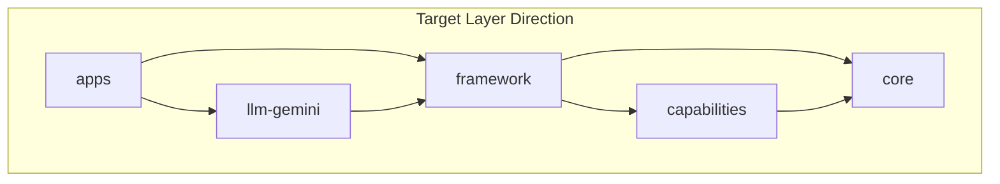

# Phase A: System Dependency Simplification

## Goal

Reduce internal dependency complexity in `packages/supervisor-framework` and enforce architectural boundaries via `.dependency-cruiser.cjs`. Target state: **0 circular deps**, **0 core→framework imports**, **app layer rules enforced in CI**.



## Violations addressed

| Issue | Path |
|-------|------|
| Cycle 1 | `capabilities/index` → `validate-persisted-agents` → `system-agent/definition` → `capabilities/index` |
| Cycle 2 | `core/execution/context` ↔ `core/types/policy` |
| Cycle 3 | `framework/cron/cron-run-ledger` ↔ `framework/cron/cron-runner` |
| Layer | `core/supervisor/supervisor-node` → `framework/system-agent/cache-prompt` |
| Layer | `core/persistence/read-only-repositories` → `framework/cron/types` |

## Step 1: Break cron-runner ↔ cron-run-ledger cycle

Move shared run types (`CronJobRun`, `CronJobResult`, `CronExecutionReporter`) to `framework/cron/types.ts`. Both `cron-runner.ts` and `cron-run-ledger.ts` import from `types.ts`.

## Step 2: Break capabilities ↔ system-agent cycle

- `validate-persisted-agents.ts`: use `isRuntimeAgentBuiltin` from `core/types/agent.ts` instead of `isSystemAgentId` from framework.
- `definition.ts`: import `CapabilityCatalog` from `capabilities/catalog.js` and `configurationReposAvailable` from `capabilities/types.js` (not barrel).

## Step 3: Break context ↔ policy cycle

Introduce `core/types/graph-bundle-context.ts` with `GraphBundleContext` (context without `runtimeAgentPolicy`). `policy.ts` uses `GraphBundleContext`; `context.ts` extends it with `runtimeAgentPolicy`.

## Step 4: Fix core → framework layer violations

- Extract `buildTurnContextMessage` and `buildCachedRuntimePromptMessages` to `core/supervisor/cache-prompt-messages.ts`.
- Keep `CronJobDefinition` and `CronJobRepository` in `framework/cron/types.ts`; move `createReadOnlyCronJobRepository` to `framework/cron/read-only-cron-job-repository.ts` (core no longer owns cron contracts).

## Step 5: Enforce layers in dependency-cruiser

Add rules: `core-not-to-framework`, `capabilities-not-to-system-agent`, app layer rules (runtime-agents, policies, prompts). Upgrade `no-circular` to `error`. Wire `pnpm depcruise` into `pnpm check`.

## Verification

```bash
pnpm --filter @personal-assistant/supervisor-framework test:unit
pnpm --filter personal-assistant test:unit
pnpm depcruise
pnpm check
```

## Out of scope (Phase B/C)

See [DEPENDENCY_SIMPLIFICATION_PHASE_B.md](./DEPENDENCY_SIMPLIFICATION_PHASE_B.md) for config slices and the move-only `personal-pack` / `buildPersonalCapabilityProviders` extract (done in Phase B).

Still deferred to Phase C: framework public API barrel / subpath split, optional `core/types/agent.ts` split. Runtime-agents ↛ integrations is already enforced by cruiser (not a Phase B code change).
