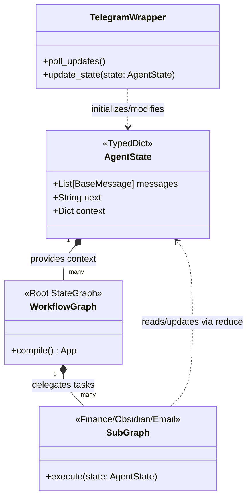

### Key Clarifications in this Diagram:

1. **`AgentState` is the Hub:** Notice it is placed at the top/center. It is not owned by any single agent; rather, the agents (sub-graphs) are granted access to it.
2. **`SubGraph` interaction:** Each sub-graph is effectively a process that "plugs in" to the `AgentState`. When you execute a sub-graph, it takes the current `AgentState`, performs its specific logic (like categorizing a Wise transaction), and returns a partial state update.
3. **`WorkflowGraph` Orchestration:** The root `WorkflowGraph` manages the _lifecycle_ of the `AgentState`, deciding which sub-graphs are permitted to access or modify it at any given time.
4. **`TelegramWrapper` Ingress:** This shows the wrapper as the primary trigger. It initializes the `AgentState` (by creating the first `HumanMessage`) before passing it to the graph.

