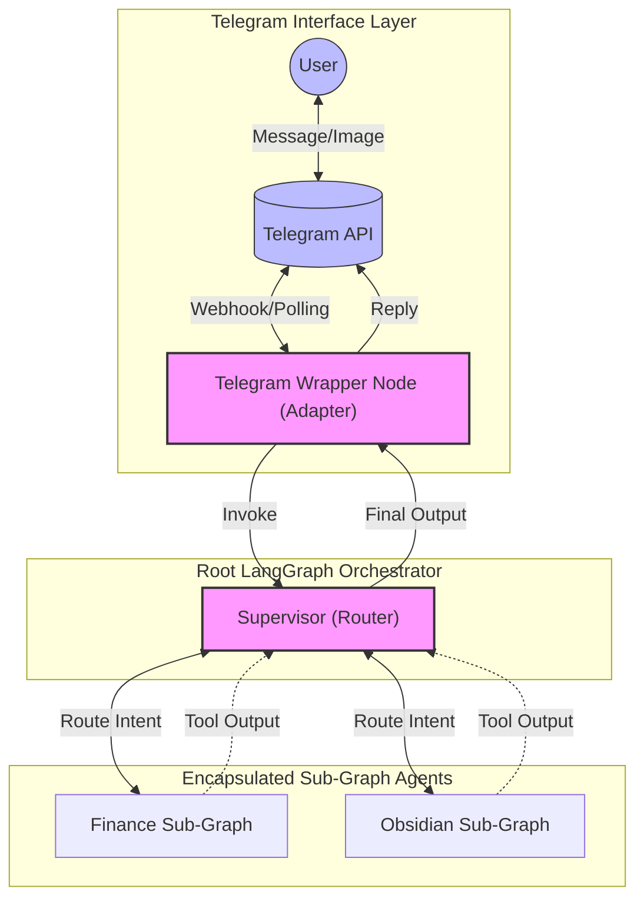

### Key Responsibilities by Layer

#### 1. The Telegram Wrapper (The Ingress)

- **Parsing:** It acts as the "translator." It takes the raw Telegram JSON object and extracts the `chat_id`, `text`, and any `photo` payloads.
- **Normalization:** It converts these into standard LangChain `HumanMessage` objects.
- **State Trigger:** It calls `app.invoke()` (or `stream()`), passing the normalized message into the graph’s memory.
- **Response Handling:** When the graph reaches the `END` state, the Wrapper intercepts the final message and ships it back to the user via the `sendMessage` Telegram API.

#### 2. The Root Orchestrator (The Supervisor)

- **Context Management:** It holds the `RootState` (the shared memory for the session).
- **Routing Logic:** It examines the latest `HumanMessage` from the Wrapper and decides which sub-graph (if any) should handle the request based on the user's intent.
- **Traffic Cop:** It ensures the Finance Agent doesn't receive "Obsidian" related messages, keeping tokens low and execution precise.

#### 3. The Sub-Graphs (The Workers)

- **Task Isolation:** Each sub-graph contains its own specialized system prompt and tools.
- **Memory Scope:** They only receive the `RootState` subset that they need to function. They don't need to know the Telegram API exists; they only know how to process their specific logic and return the result to the Orchestrator.